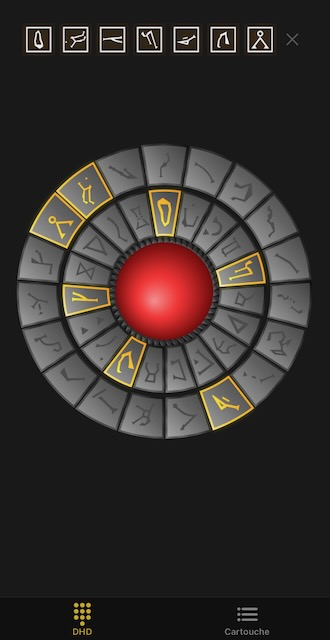
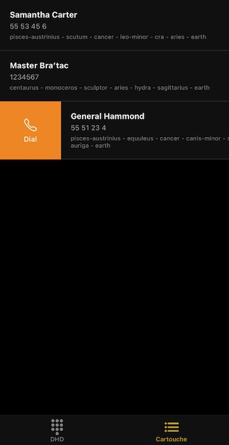

# Dial Home Device

Greetings, Tau'ri! This application simulates the Stargate Dial Home Device (DHD). Instead of establishing wormholes to
distant planets, this DHD connects you to your contacts via the primitive Tau'ri communication network (also known as
"phone calls").

Stargate and all related marks, logos, and concepts are trademarks of **Amazon MGM Studios**.
This application is not affiliated with, endorsed by, or sponsored by Amazon MGM Studios.




## Technology Stack

- React Native
- Expo SDK
- TypeScript

## Installation

### Prerequisites

- Node.js 18+
- npm or yarn
- Expo CLI
- Optional: iOS or Android Emulator

### Setup

```bash
git clone https://github.com/cowbellerina/mobile-dhd.git
cd mobile-dhd
npm install
npm start
```

### Running on Device/Simulator

```bash
# iOS
npm run ios

# Android
npm run android

# Web (limited functionality)
npm run web
```

## Development

```bash
npm test
npm run lint
```
